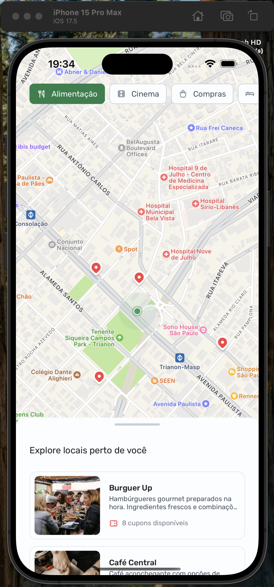
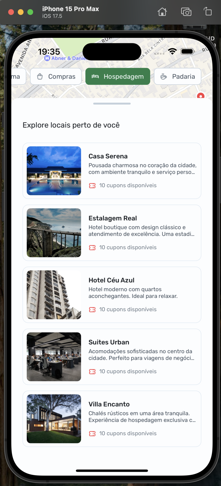
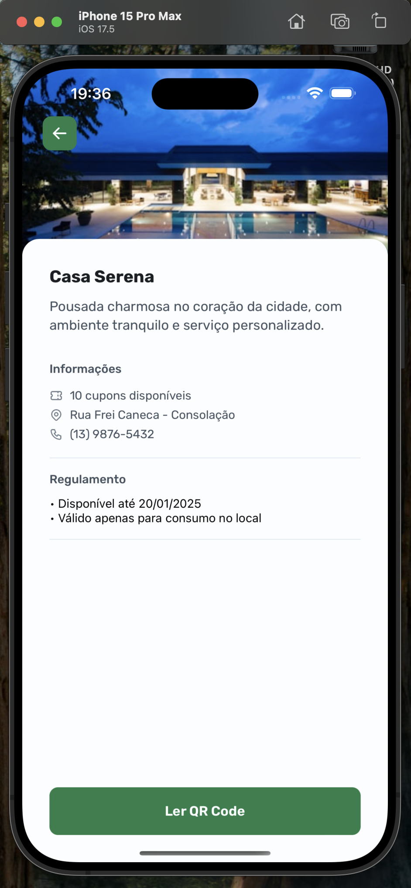

<h1 align="center"> Nearby </h1>

Programa exclusivo e gratuito, promovido pela Rocketseat para ensino de tecnologias WEB.  

  <a href="#-tecnologias">Tecnologias</a>&nbsp;&nbsp;&nbsp;|&nbsp;&nbsp;&nbsp;
  <a href="#-projeto">Projeto</a>&nbsp;&nbsp;&nbsp;|&nbsp;&nbsp;&nbsp;
  <a href="#-layout">Layout</a>&nbsp;&nbsp;&nbsp;|&nbsp;&nbsp;&nbsp;
  <a href="#memo-licença">Licença</a>

  

 

  
  
  
  

## 🚀 Tecnologias

Esse projeto foi desenvolvido com as seguintes tecnologias:

- Expo
- React Native
- HTML, CSS
- JavaScript/Typescript
- Git e Github
- Figma

## 💻 Projeto

O Nearby é um projeto que linca estabelecimentos cadastrados com descontos à usuários em busca de descontos seja estes em alimentação, vestuário, qualquer loja ou serviço que ofereça o benefício.

Vale lembrar que foi utilizado geolocalização, recursos de camêra para escanear e validar o QR Code

## 🔖 Layout

Você pode visualizar o layout do projeto através das imagens disponibilizadas por aqui, pois o figma do projeto não está mais acessível e você não poderá acessá-lo.

## :memo: Licença

Esse projeto está sob a licença MIT.

---
